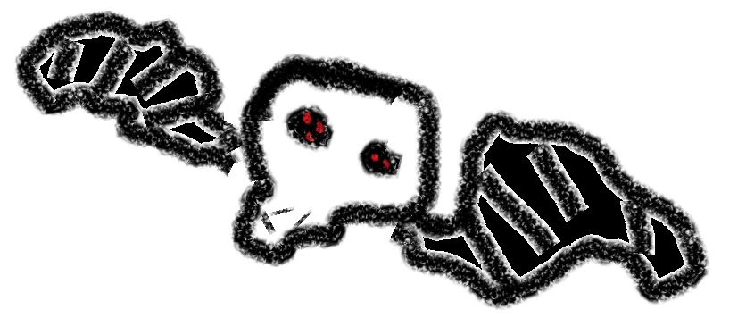

# Ruin Dangers

These monsters are all creatures that can live in the darkness of a ruin or cave with little .  They are natural dungeon dwellers, and do not have to worry about securing large amounts of food, or mortal concerns like aging.

They are ideal monsters to place in a tomb that has been sealed away for a hundred years, or some other location that has otherwise been locked away where putting a more natural monster would threaten the suspense of disbelief.

- [Skullbat](ruinDangers.md#skull-bat) - CR 1/4
- [Skullbat, Dire](ruinDangers.md#skullbat-dire) - CR 1

## Skullbat

*Tiny Field, Chaotic Evil*

---

**Armor Class** 13

**Hit Points** 10 (4d4)

**Speed** 5 ft., fly 20 ft.

**Initiative** +1

---

| STR | DEX | CON | INT | WIS | CHA |
|-|-|-|-|-|-|
| 6 (-3) | 12 (+1) | 10 (+0) | 4 (-4) | 9 (-1) | 8 (-2) |   

---

**Skills** Perception +1

**Damage Vulnerabilities** Bludgeoning, Radiant

**Damage Resistances** Slashing, Piercing

**Damage Immunities** Necrotic

**Senses** Darkvision 60 ft., Passive Perception 11

**Languages** Infernal (can understand but cannot speak)

**Challenge** 1/4 (YYY XP)

**Proficiency Bonus** +2

---

**Wings of Night.**  While in sunlight, the Skull Bat cannot fly.

---

### Actions

**Slam.** +3 to hit, reach 5 ft., one target.  *Hit:* 3 (1d4 + 1) bludeoning damage and  3 (1d6) necrotic damage.

---

### Description

Skullbats are tiny fiends thought to be related to [Shadow Demons](https://www.dndbeyond.com/monsters/17131-shadow-demon).  Small on their own, they are weakened by direct sunlight.  Each one is a small black orb of flesh about the size of an adult's fist, with four to seven small red eyes spread irregularly along the surface, and two leathery wings protruding from their body.

Their name comes from their habit of inhabiting skulls.  Like a hermit crab, a skullbat will crawl into a skull of a humanoid or animal for protection.  This helps reduce the negative traits of sunlight, and protects them from many weapon attacks.  Their wings can extend out through the back of the skull, letting them fly.

In battle, the skullbat will slam itself against a foe, its own necrotic radiation adding to the damage done by being struck by the hard bone.  However, if exposed to sunlight, the skullbat will hide in the skull.  Its wings will not be able to maintain power in the light, so instead of flying, it will hop about inside of the skull and throw itself at its enemies.

Skullbats feed off of trace amounts of necrotic or infernal magic, as well as psychic pain.  They often lurk around graveyards or old crypts both for nourishment and the variety of skulls to use for protection.

Many less studied adventurers would think the skullbat is a necromantic creation meant to make the skull fly, but things like turn undead will not be successful against it.

## Skullbat, Dire

*Small Field, Chaotic Evil*

---

**Armor Class** 13

**Hit Points** 44 (8d6 + 16)

**Speed** 5 ft., fly 20 ft.

**Initiative** +1

---

| STR | DEX | CON | INT | WIS | CHA |
|-|-|-|-|-|-|
| 10 (+0) | 14 (+2) | 14 (+4) | 4 (-4) | 11 (+0) | 8 (-2) |   

---

**Skills** Perception +2

**Damage Vulnerabilities** Bludgeoning, Radiant

**Damage Resistances** Slashing, Piercing

**Damage Immunities** Necrotic

**Senses** Darkvision 60 ft., Passive Perception 12

**Languages** Infernal (can understand but cannot speak)

**Challenge** 1 (YYY XP)

**Proficiency Bonus** +2

---

**Wings of Night.**  While in sunlight, the Skull Bat cannot fly.

---

### Actions

**Slam.** +3 to hit, reach 5 ft., one target.  *Hit:*  5 (1d6 + 2) bludeoning damage and  9 (3d6) necrotic damage.

---

### Description

A skullbat's growth is limited by the size of its host skull.  A lucky few find giant skulls, and so are able to grow to be even larger, becoming dire skullbats.